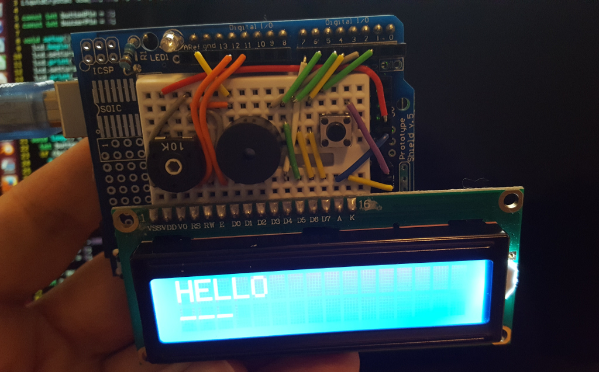

# Arduino Morse Decoder

This is a very simple Arduino build of a sounder and LCD screen to display decoding.

Sorry, there is not a schematic. Perhaps you can follow the wiring in the photo:

It's simply a button on pin 2, a piezo buzzer on pin 3 and an LCD screen wired [as described here](https://www.arduino.cc/en/Tutorial/LiquidCrystalDisplay) (but to pins 4-7).

It displays the dits and dahs on the second row while showing the decoding on the first.

# Internals

There is not much interesting in the < 100 lines of code. However the decoding is a little bit clever and should be explained briefly.

All of Morse Code is described in the single `morse` string. A pointer (`p`) begins at index `1`. Each dit doubles this pointer while each dah doubles and adds one. This way a tree is walked; each node of which is the decoded character.

