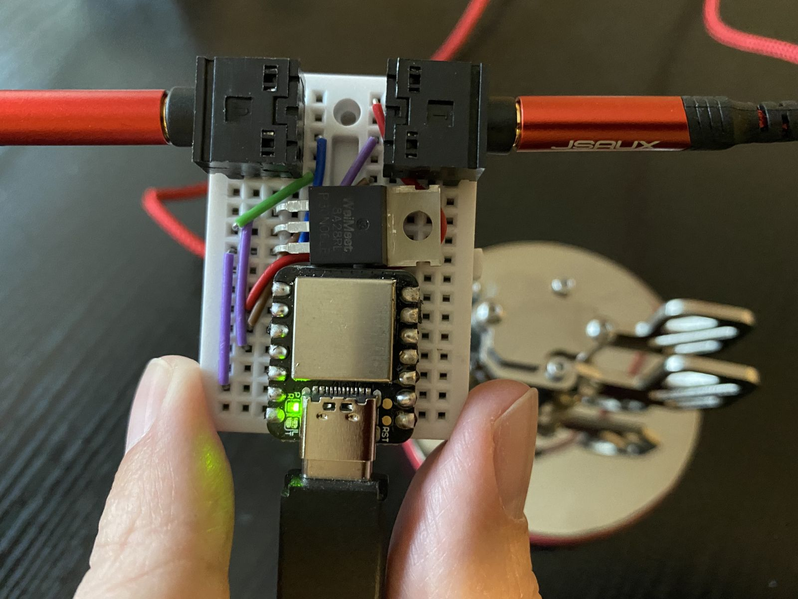

# v2 Arduino Morse Decoder

This is an even simpler Arduino build made to run on the Seeed SAMD board. It has no screen, dimmer, or buzzer. It merely connects to a key/paddle, to a radio, and to a computer that drives and configures everything via the web page.

## Features

- Support bug mode (auto-repeat dits, manual dah)
- Support straight key mcu-side (currently a hack, client-side only, relaying key state thru MCU to radio)