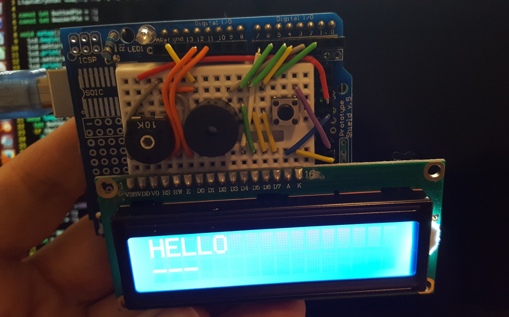

# v1 Arduino Morse Decoder

This is a very simple Arduino build of a sounder and LCD screen to display decoding.

Sorry, there is not a schematic. Perhaps you can follow the wiring in the photo:

It's simply a button on pin 2, a piezo buzzer on pin 3 and an LCD screen wired [as described here](https://www.arduino.cc/en/Tutorial/LiquidCrystalDisplay) (but to pins 4-7).

It displays the dits and dahs on the second row while showing the decoding on the first.

----

I've added connectors for a paddle and to a radio, a transistor to key the radio, and a serial interface with the web page to display what's being keyed and to send text to be keyed on the radio.

## TODO

- Adjustable side tone pitch (currently 750Hz)
- Adjustable space between letters and words (both for sending and expected copy -- e.g. sending extra work/letter breaks, adjusting timeout on RX)